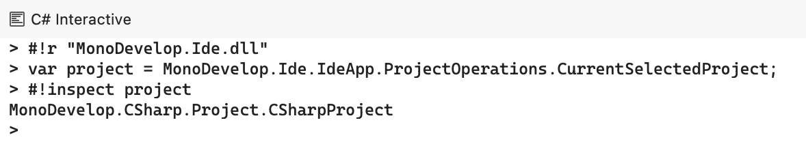
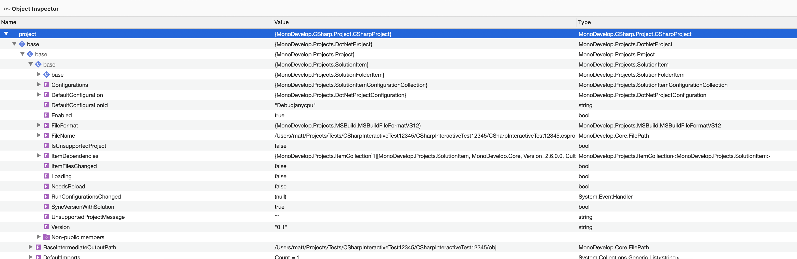

# C# interactive for MonoDevelop and Visual Studio for Mac

Provides a C# REPL to interact with the IDE.

Uses the .NET Interactive library:

https://github.com/dotnet/interactive

Which is used by dotnet repl:

https://github.com/jonsequitur/dotnet-repl

# C# Interactive window

From the View menu select Pads - C# Interactive.

The C# Interactive window provides access to the C# REPL.
The REPL is run in process with the IDE so you can access and interact
with types running in the IDE.

# Object Inspector window

From the C# REPL window when you use the `#!inspect` method the
object passed will be open int the Object Inspector window.

The Object Inspector window uses the tree view which is used
by the debugger. It allows you to browse members of the object
and update values such as strings and ints in the same
way you can in the debugger. 